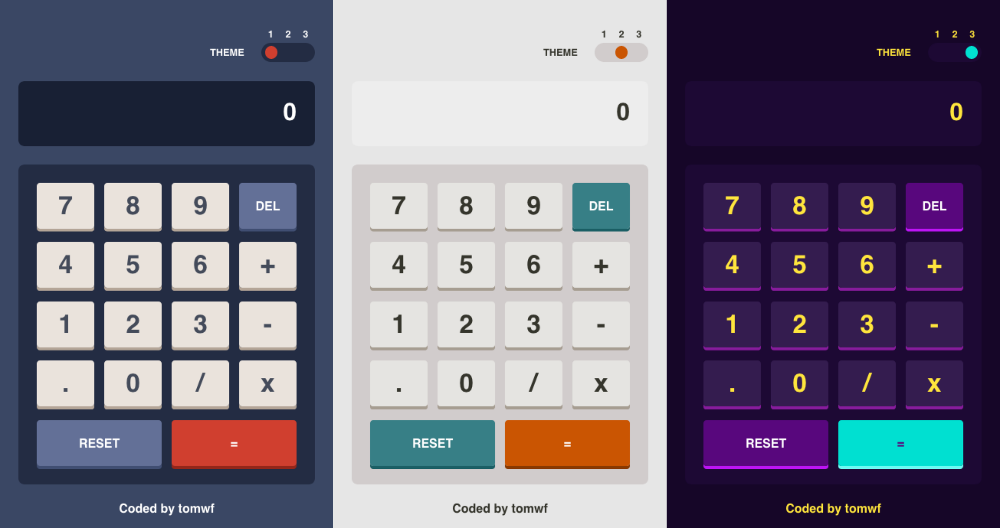

# Calc

This is a simple calculator app in which the user can switch between 3 themes.



## Table of contents

- [How To Use](#how-to-use)
- [Link](#link)
- [Built with](#built-with)

## How To Use

```bash
https://github.com/tomwf/calc.git
```
Navigate into the directory:
```bash
cd calc
```
Install the dependencies:
```bash
npm i
```
Run the local dev environment:
```bash
npm start
```
Open your browser and visit:
```
http://localhost:3000
```

## Link

- Live Demo: [Calc](https://tomwf-calc.netlify.app/)

## Built with

- [Sass](https://sass-lang.com/documentation)
- [Flexbox](https://css-tricks.com/snippets/css/a-guide-to-flexbox/)
- [CSS Grid](https://css-tricks.com/snippets/css/complete-guide-grid/)
- [React](https://reactjs.org/)
